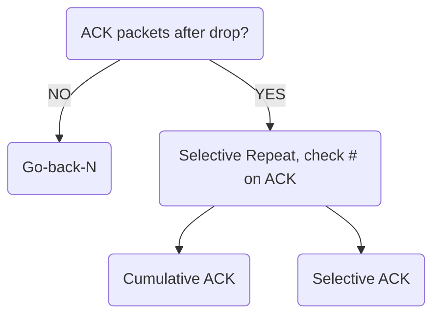

<h1>Lecture 13</h1>

## Handling dropped packets

### Sliding Window with Go Back N
When a receiver notices missing data, it simply **discards** all data with greater sequence numbers.

The sender will eventually time out (RTO) and retransmit data in sending window.

The main benefit of Go back N is that it can recover from erroneous or missing packets. However, it is very wasteful.

If any errors occur, the sender spends time and network retransmitting data that the receiver has already seen.

![[Pasted image 20221107202526.png]]
#go-back-n
### Selective repeat with cumulative ACK
The concept: the sender should only retransmit dropped/corrupted data

To accomplish this, the receiver **stores** all the correct frames that arrive following the bad one. The receiver must have the **memory to hold data** for each sequence number in the receiver window.

When the receiver notices a skipped sequence number, it keeps acknowledging the **first in-order sequence number** that it wants to receive, known as **cumulative ACK**.

When sender times out waiting for an ACK, it just retransmits first packet without ACK, not successors. This uses less bandwidth when compared to Go Back N.

Recovering each drop requires one RTO after the corresponding packet was transmitted.

![[Pasted image 20221107203117.png]]
#cumulative_ACK

### Selective repeat with selective ACK
As packets are received, the receiver ACKs the seq #.

The unique trait of selective ACK is that it sends a SACK, which acts as an ACK for all of the packets it has already received.

If the receiver receives 0, 1, drops 2, then receives 3, it will **SACK 0-1, 3**.

Upon receiving 4, it will **SACK 0-1, 3-4**.

![[Pasted image 20221107204040.png]]
