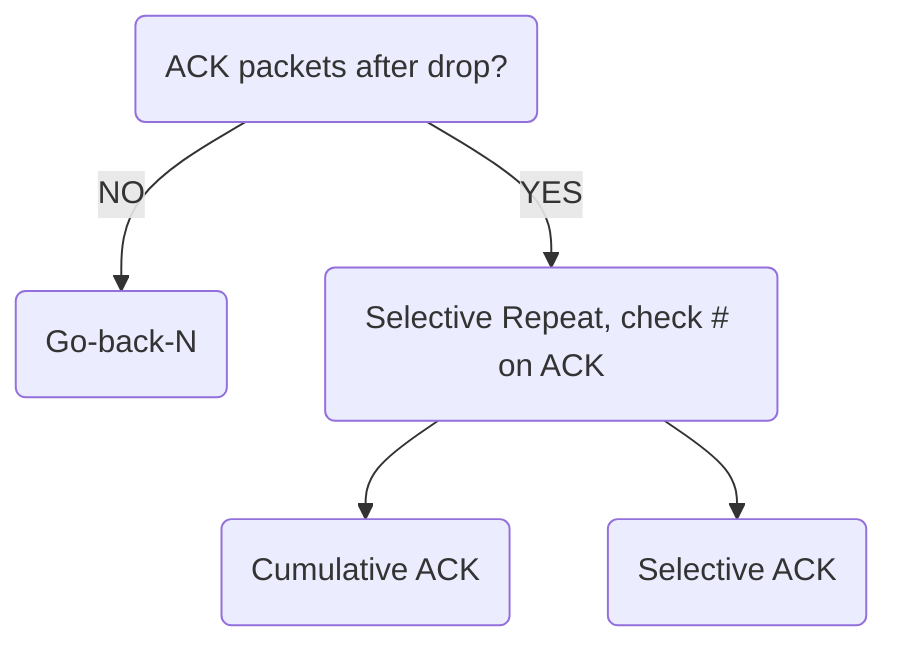

<h1>Lecture 13</h1>

## Handling dropped packets

### Sliding Window with Go Back N
When a receiver notices missing data, it simply **discards** all data with greater sequence numbers.

The sender will eventually time out (RTO) and retransmit data in sending window.

The main benefit of Go back N is that it can recover from erroneous or missing packets. However, it is very wasteful.

If any errors occur, the sender spends time and network retransmitting data 

![[Pasted image 20221107202526.png]]

