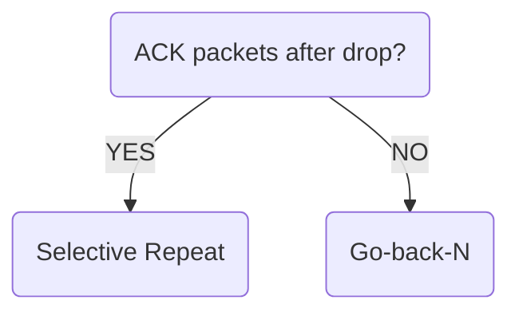

<h1>Lecture 13</h1>

## Handling dropped packets

### Identifying dropped packets

```mermaid
flowchart TD 
	ROOT(ACK packets after drop?) -- YES --> YES
	ROOT(ACK packets after drop?) -- NO --> NO
	NO(Go-back-N)
	YES(Selective Repeat)
	
```
