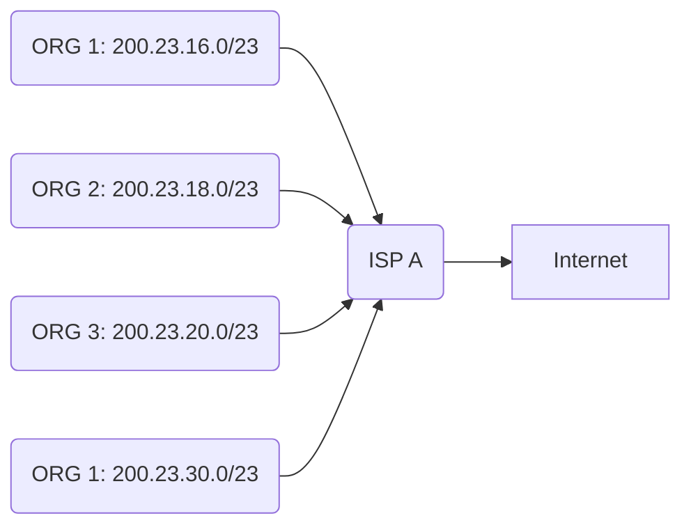

<h1>Lecture 21</h1>

## Router design
A router contains the **control plane** and the **data plane**.

The control plane manages routing of the information, following **traditional distributed routing**. There is per route-change processing every few tens of seconds.

The **data plane** performs per-packet processing every few tens of nanoseconds.

## Control processor (plane)
The control processor is a general-purpose processor that "programs" the data plane:
- uses forwarding table
- manages scheduling and buffer management policy

It implements the **routing algorithm** by processing **routing protocol messages**.

### IP block reallocation
Organizations can reallocate a subset of their IP address to other organizations.

For example, ISP A owns the IP block 200.23.16.0/20 and allocates it for other organizations..

**Route aggregation** is used to save forwarding table memory by reducing number of routing protocol messages.

There is an **announcement mechanism** (Border Gateway Protocol) by which ISP A can inform the rest of the internet about the prefixes it owns. It is enough to announce a coarse grained prefix $200.23.16.0/20$ rather than 8 seperate sub-prefixes.

$200.23.18.0/23$ is inside $200.23.16.0/23$.

A packet with destination IP address 200.23.18.XX is in both prefixes. The router will choose which forwarding output by whatever the organization prefers.

## Longest Prefix Matching
With LPM, use the **longest** matching prefix, i.e., the most specific route, among all prefixes that match the packet. 

Policy is borne out of the Internet's IP allocation model. Prefixes and sub-prefixes are handed out by the Internet IP allocation.

Internet routers use longest prefix matching to forward packets appropriately.

LPM is used by ISPs to allocate sub-prefixes of a larger prefix to organizations.
*e.g. Verizon allocates a sub-prefix / subnet to Rutgers*. 
The ISP also announces the aggregated prefix to the Internet to save on number of forwarding table memory and number of announcements.

As a result, the organization can be reached over multiple paths - for example, another ISP like AT&T. However, the organization has a preference to use one path over another and expresses this by announcing the longer (more specific) prefix.

Routers in the internet should route based on the longer prefix.

Longest prefix matching ensures packets are routed across the preferred routes.

## IPv4 Datagram Format
The IPv4 datagram format has an overhead of about 40 bytes, 20 bytes of IP and 20 bytes of TCP.

The components are:
- version
- header length
- type of service (traffic differentiation)
- datagram length
- 16-bit identifier
- flags
- fragment offset
- time to live
- upper protocol (upper layer protocol to deliver payload: TCP, UDP)
- source IP
- dest IP
- options (timestamp. record route, specify list of routers)
- misc. data

The 16-bit identifier, flags, and fragment offset are used for fragmentation and reassembly.

## Internet Control Message Protocol (ICMP)

ICMP is a protocol for **troubleshooting** and diagnostics and it works over IP.

This protocol diagnoses the **unreliable delivery** of packets. It's functions are:
- determining the reachability and network errors
- specify that packets have been in network for too long

The ICMP follows the format of:
- ICMP header: message type, code, checksum, and ICMP data
- IP header

It is used for:
- echo request replies - check remotely if an endpoint is alive and connected without running app on remote server
- probing unreachable destinations - invalid address / port
- knowing of packet's TTL have expired - check routing loops

### Ping
- Uses the ICMP echo request (type=8, code=0) and reply (type=0,code=0)
- Source sends ICMP echo request message to dst address
- Destination network stack replies with an ICMP **echo reply** message
- Source can calculate round trip time (RTT) of packets
- If no echo reply comes back, then the destination is unreachable
- Don't need to have server program running on other side

