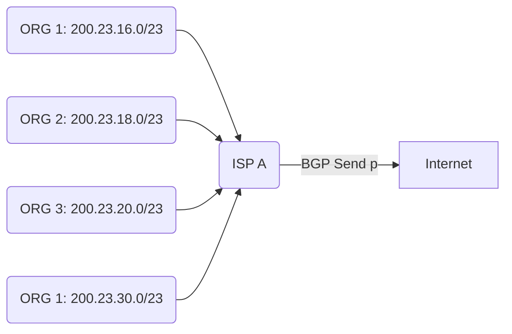

<h1>Lecture 21</h1>

## Router design
A router contains the **control plane** and the **data plane**.

The control plane manages routing of the information, following **traditional distributed routing**. There is per route-change processing every few tens of seconds.

The **data plane** performs per-packet processing every few tens of nanoseconds.

## Control processor (plane)
The control processor is a general-purpose processor that "programs" the data plane:
- uses forwarding table
- manages scheduling and buffer management policy

It implements the **routing algorithm** by processing **routing protocol messages**.

### IP block reallocation
Organizations can reallocate a subset of their IP address to other organizations.

For example, ISP A owns the IP block 200.23.16.0/20 and allocates it for other organizations..

## Longest Prefix Matching

