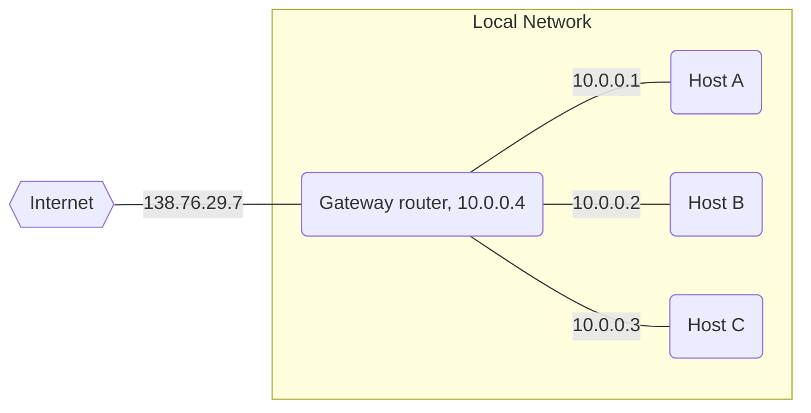

<h1>Lecture 22</h1>

## Internet Control Message Protocol (ICMP)

>*ICMP is a protocol for **troubleshooting** and diagnostics and it works over IP.*

### Traceroute
Traceroute is a tool records the router-level path taken by packets. It cleverly uses the IP time-to-live field to identify all the routers in the path.

When a router receives an IP packet, it decrements the TTL field by 1. When the TTL is decreased by one, the IP packet is discarded. This is a failsafe mechanism to ensure packets don't take up too much memory in the network. 

The traceroute algorithm works as follows:
- Send a packet with TTL = n to IP
- Packet is received by router, then TTL is decremented by 1
- If TTL is now 0, then respond to source with TTL exceeded
- Otherwise, forward to next router
- When source receives TTL exceeded, n = n+1 and jump back to first step
- If source receives ICMP reply, we know the destination is reachable and learned all routers in  the path

## Network Address Translation

### Background
Older networks had incompatible addressing with the internet's network layer protocol (IPv4 vs. X25). Additionally, the routable address ranges vary across different networks. It's extremely challenging to unify all networks onto a single standard.

Furthermore, entire networks were changing their Internet Service Providers, which do not want to route directly to internal endpoints.

As the internet constantly expands, IPv4 addresses are rapidly exhausted. There are not sufficiently large IP blocks, even for networks. For example, Rutgers has more than 130,000 publicly routable IP addresses and IIT Madras has 512.

### How it works
NAT addresses the internet's growing pains by modifying fields in an IP packet.
Routers modify IP packets in an IP packet to:
- enable communication across networks with different addressing formats and address ranges
- allow a network to change its connectivity to the internet en masse by modifying the source IP to a publicly-visible gateway IP address
- masquerade as an entire network using (say) one publicly visible IP address

### Typical NAT setup (NAPT)

The NAT gateway router accomplishes this by using a different transport port for each distinct (transport-level) conversation between the local network and the Internet.

The gateway router maintains a translation table that records an "internet side" and "local side". The "internet side" is the public IP address for the local machine and the "local side" is the real IP.

The router manages the connections and datagrams transmitted, acting as a middleman for data coming in and out of the network. Outbound data has its source IP changed to its corresponding "internet side IP" and inbound data has its destination IP changed to its corresponding "local side" IP.

Example interaction:
1. Host 10.0.0.1 sends datagram to an **external host**, 128.119.40.186, at port 80
2. The NAT router changes the datagrams source address and port from 10.0.0.1:3345 to 138.76.29.7:5001 and updates the translation table
3. Reply arrives to destination port 138.76.29.7:5001
4. NAT gateway changes datagram destination address, port from 138.76.29.7:5001 to 10.0.0.1:3345

### Benefits of IP-masquerading NAT
- Uses much fewer public IP addresses
- Change of addresses of devices inside the local network freely because the gateway maintains the map
- Change public IP address of local endpoints freely because gateway maintains the map
- Devices inside the local network are not publicly visible, routable, or accessible
- Most IP masquerading NATs block incoming connections originating from the internet
	- The only way to communicate is if the internal host initiates the conversation

### Where is NAT used?
#### Home
Most access routers (home WiFi routers) implement NAT, which you can check by comparing local address to your externally-visible address.

#### Public cloud
Each VM has it's own IP address, but it is attached to a physical machine which has the local IP address.

### Limitations of IP-masquerading NATs
- Connection limit due to 16-bit port-number field
	- ~64k total simultaneous connections with a single public address
- Can be controversial because router manipulates headers of packets to a significant level (up to the network layer, as opposed to just the transport layer)
- Application developers must take NAT into account (skype, p2p, etc)

Instead, the address shortage can be solved with the usage of IPv6. Even with 32-bit IP addresses, we will eventually exhaust all available IP addresses.

## Routing Protocols
