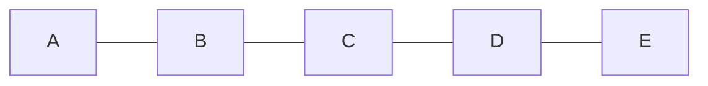

<h1>Lecture 24</h1>

## Distance Vector Propagation Speed

### Good news travels fast
When link cost reduces or a new better path becomes available, the message propagates quickly within the network. Immediate neighbors of the change detect the better path **immediately**.

Since their distance vector changed, these nodes notify their neighbors immediately, who notify more neighbors. This process repeats until the entire network knows to use the better path.

**Good news travels fast** through the network, **despite** messages **only being exchanged among neighbors**.

### Bad news travels slowly
If a router goes down, it could be a while before the network realizes it.

Reacting appropriately to bad news requires information that only other routers have because **distance vectors do not exchange sufficient info.**

In this situation, 
- B needs to know that C has no other path to A other than via B
- DV does not exchange paths; just distances
- Poisoned reverse: if $X$ gets its route to $Y$ via $Z$, then $X$ will announce $d_x(Y)=\infty$ in its message to $Z$
	- As a result, Z won't use $X$ to get to $Y$
	- However, this won't solve the problem in general

### Summary
On the internet, we can not assume that:
- every router is aware of the existence of every other router
- messages reveal information the full network (graph) structure
- message exchange and forwarding tables scales with network size

#### Link State Algorithms
In link state algorithms, the nodes have full visibility into the networks graph but there is a copious message exchange. Each LSA is flooded over the entire network.

However, it is robust to network changes and failures. This algorithm is known as OSPF (open shortest path first).

#### Distance Vector Algorithms
Only distances and neighbors are visible and message exchanges are sparse. Distance vectors are exchanged among neighbors only.

Brittle to router failures. Incorrect info may propagate all over the net. This algorithm is known as EIGRP (Enhanced Interior Gateway Routing Protocol)

## Internet Routing
The internet is a **federated** network, meaning that it no one organization manages it. Organizations cooperate while also competing with eachothers.

Although AT&T cooperates with Verizon, it has few commercial interest in revealing its internal network structuer to Verizon. As a result, any message exchanges should not reveal internal network details.

Any algorithms that implement internet routing must work with an "incomplete" subset of information about its neighbors' internal topology.

The internet is an incredibly large federated network with more than 70,000 unique autonomous networks and more than 800,00 forwarding table entries.

So, we must keep messages and tables as concise as possible. Must avoid flooding the network. Furthermore, any algorithm must be **incremental**, meaning that any algorithm implemented can not recompute the table for each exchange.

### Inter-domain Routing
The link state protocol and distance vector protocol are applicable within one autonomous system (AS). These approaches are called the **intra-domain** routing protocols.

The internet uses something called the Border Gateway Protocol (BGP), which all AS use. BGP is a **path vector protocol**.

#### Border Gateway Protocol
With BGP, routers will emit **routing announcements** or **advertisements**, indicating that:
- "I am here" or "I can reach here"
These announcements / advertisements occur over a TCP connection (**BGP session**) between routers.

A **route announcement** is made up of a destination and its attributes.
- **Destination**: IP prefix
- **Attributes**: AS-level path, next hop, origin, MED, community, etc.

An AS promises to use advertised path to reach destination. The route changes are advertised after the BGP session is established.

##### Next Hop
> **Next hop** conceptually denotes the first router interface that begins the AS-level path.

The meaning of the 'next hop' attribute is context-dependent.

In an announcement arriving from a different AS (**eBGP**), the next hop is the router **in the AS** which sent the announcement.

![[Pasted image 20221217180551.png]]

Suppose router 

