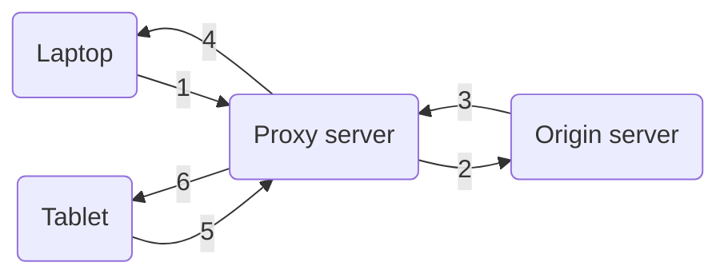

<h1>Lecture 6</h1>

## HTTP Cookies

HTTP mechanisms are **stateless** - each request is processed independently and the server maintains no memory about past client requests.

#stateless, #states, #cookies

**State** is essential in servicing users. Using states, we are able to implement features such as user authentication, shopping carts, video recommendations, and any user session state in general.

### How it works
Cookies keep a users memory. The **client and server collaborate** to track user state.

There are four components of a cookie:
1. Cookie header line of **HTTP response message**
2. Cookie header line in **HTTP response message**
3. Cookie file kept on user endpoint, managed by user's browser
4. Back-end database maps cookie to user data at Web endpoint

### Cookie usage
Cookies can be used in many different ways, some good, some bad, and some ugly. For an internet user, the most common ways a they will experience cookies in use is in shopping carts, user authentication, etc.

Some uses of cookies are bad. They unnecessarily record activities across the site for performance statistics, user engagement, and more.

Cookies can be used to intrude on a user's privacy. Third party cookies that are played by ads and tracking networks can track activities across the internet. This usage of cookies leads to potentially personally identifiable information being contained in cookies.

## Web caching
Web caches are machines that remember web responses for a network.

They reduce the response time for client requests and reduce traffic on an institution's access link.

Devices can be configured to use an HTTP proxy. If a proxy for a device is set, all HTTP requests will be sent to the proxy (cache).

On a cache hit, the cache returns the object.
On a cache miss, the cache obtains the object from the originating web server (**origin server**) and returns the object to client. It also caches it locally.

In the diagram above, the following events occur.
1. Laptop asks for `foo.html`, cache miss on object
2. Proxy server asks for object from origin server
3. Origin server transmits object to proxy server
4. Proxy server obtains and transmits object to laptop, caches object locally
5. Tablet asks for `foo.html`, cache hit
6. Proxy server returns object

### Conditional GET
With caching. it's possible for information to be cached then updated later. resulting in the cached content to become out-of-date.

The **conditional GET** guarantees that cache content stays up-to-date while still saving traffic and response time when possible.

When a client requests a resource from a server, it will include a field `If-modified-since: <date> `. 
- If the object has been modified since `<date>`, then the server will return the new object, the HTTP status code 200, and  `Last-modified: <date>` in the body.
- If the object hasn't been modified, the server will return the cached object and the HTTP status code 304 Not Modified

## Content Distribution Networks (CDN)
A content distribution network is a global network of web caches that is provisioned by ISPs, network operators, or content providers like Netflix and Google.

It has many uses and the benefits overlap with that of web caching.
- reduce traffic on a network's internet connection
- improve response time for users: CDN nodes are closer to users than origin servers
- reduce bandwidth requirements on content provider
- reduce money spent on maintaining origin server

#cdn
### Uses for CDN
CDN can distribute content of the origin server over geographically distributed CDN servers.

The CDN runs their own DNS server that directs user to their "closest" CDN web servers. With CDN, the NS record delegates the choice of IP address to the CDN name server.

Custom logic is used to map ONE domain name to one of many available IP addresses.

#dns